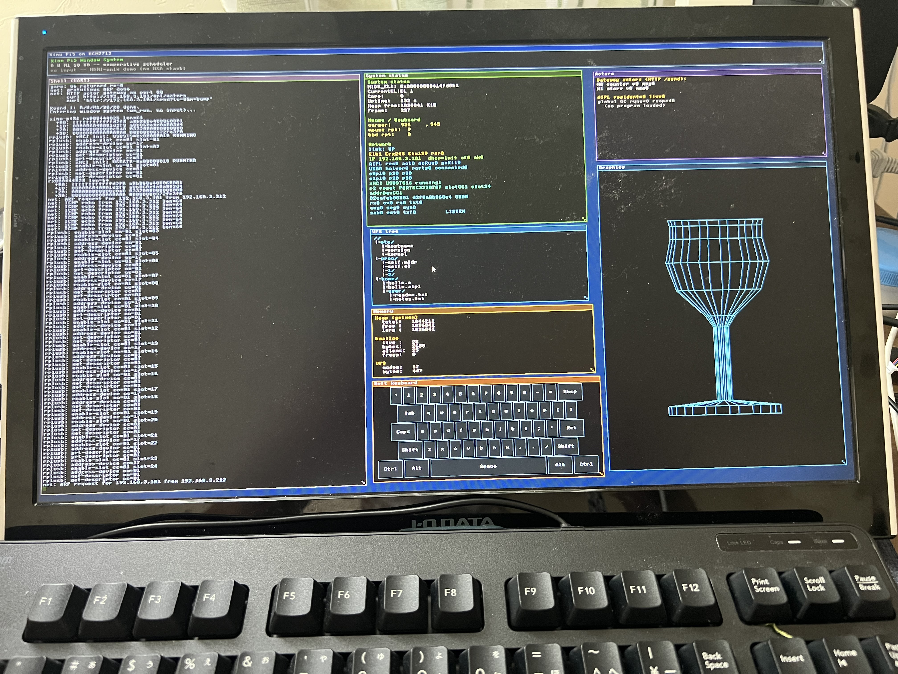

# xinu-rpi5

Embedded Xinu port for the Raspberry Pi 5 (BCM2712, Cortex-A76,
AArch64-only).



*Xinu on real Pi 5 hardware: a window-managed HDMI desktop with a live shell,
system-status / actors / VFS-tree / memory panels, an on-screen keyboard, and a
spinning 3-D wireframe wine glass — driven by a USB mouse and keyboard over the
RP1 xHCI controllers.*

This is a brand-new repository, bootstrapped from
[`yaskodama/xinu-rpi`](https://github.com/yaskodama/xinu-rpi)
(arm-qemu / arm-rpi platforms, 32-bit) and the AArch64 boot pattern
from [`radlyeel/leex`](https://github.com/radlyeel/leex).  The
existing 32-bit Xinu tree stays where it is; Pi 5's mandatory
AArch64 instruction set, new MMIO layout, and RP1 I/O hub make a
clean split easier than ifdef-walling everything in place.

## Status

| Phase (from `AIPL_XinuRPi5_Round1.aice`) | State |
|------------------------------------------|-------|
| **B0** aarch64 toolchain ready           | ⏳ user-side (`brew install aarch64-none-elf-gcc`) |
| **B1** AArch64 boot stub (`kernel/boot.S`)| ✅ |
| **B2** `kernel_2712.img` build pipeline   | ✅ |
| **U0** PL011 UART0 driver                  | ✅ |
| **U1** kprintf — banner only for now       | ✅ (basic puts; full kprintf later) |
| M0 MMU flat identity map                  | ⏳ |
| **M1** Kernel heap                         | ✅ first-fit (Xinu `getmem`/`freemem`), 16-byte align, coalescing |
| **S0** AArch64 context switch              | ✅ cooperative `ctxsw.S` + `proctab[8]` + FIFO ready list |
| S1 GIC-400 + generic timer                | ⏳ |
| **X0** xsh on Pi 5 — interactive REPL      | ✅ minimal (help/echo/hello/mem/peek/uptime/reboot) |
| X1 AIPL hello                             | ⏳ |

The boot path right now is **leex stub → BSS clear → `kernel_main` →
banner → `shell_main()` REPL**.  USB-serial cable on header pins 8 / 10
should show:

```
================================================
  Xinu Pi5 hello (AArch64, BCM2712, kernel_2712.img)
  PL011 UART0 @ 0x107D001000, 115200 8N1
  bootstrap: leex-style stub + xinu-rpi5 main
================================================

Round 1 phase B/U done — entering interactive shell.
Next milestones: M0 MMU, S0 ctxsw, S1 GIC+timer

type `help` for the command list.
xinu-pi5$ _
```

The shell handles backspace/DEL, echoes input, and dispatches via a
`davidxyz/xinuPi`-style `centry` table.  Built-ins:

| command           | what it does                                        |
|-------------------|-----------------------------------------------------|
| `help` / `?`      | list registered commands                            |
| `echo <words…>`   | echo args back (whitespace-collapsed)               |
| `hello`           | friendly greeting (smoke marker)                    |
| `mem`             | `__bss_start`, `__bss_end`, `_end` from `link.ld`   |
| `peek <hex_addr>` | read 32-bit MMIO word; e.g. `peek 0x107d001018` (UART_FR) |
| `uptime`          | raw `CNTPCT_EL0` (until phase S1 wires the timer)   |
| `ps`              | core / EL status table (placeholder until phase S0) |
| `halt`            | mask DAIF + PSCI `SYSTEM_OFF` via HVC — QEMU virt exits cleanly |
| `pingpong [N]`    | 2-actor AIPL-style PingPong, cooperative dispatch, N rounds (1..50, default 5), auto-terminates |
| `procdemo [N]`    | **real** 2-process ctxsw demo: creates pid 1 (ping) + pid 2 (pong), each prints its live `currpid` and `proc_yield()`s for N iters (1..30, default 5), then both `proc_exit()` and control returns to the shell |
| `reboot`          | stub — spins until power-cycle (RP1 watchdog TBD)   |

## Hardware vs Pi 4 (leex baseline)

|              | Pi 4 (leex baseline) | **Pi 5 (this repo)** |
|--------------|----------------------|----------------------|
| SoC          | BCM2711              | **BCM2712**          |
| Cores        | Cortex-A72 ×4        | **Cortex-A76 ×4**    |
| MMIO base    | 0xFE000000           | **0x107C000000**     |
| I/O hub      | direct on SoC        | **RP1 (PCIe 別チップ)** |
| Firmware img | `kernel8.img`        | **`kernel_2712.img`**|
| UART base    | `0xFE201000`         | **`0x107D001000`**   |

## Build

The repository follows the classic Embedded Xinu / davidxyz/xinuPi
subsystem layout — sources live in per-area top-level directories
(`loader/`, `mem/`, `system/`, `shell/`, `device/uart/`) and every
build artefact lands under `compile/`.

```sh
# Mac (Homebrew toolchain — pick either):
brew install aarch64-elf-gcc           # gnu cross compiler
# OR:
brew install --cask gcc-arm-embedded   # arm-supplied toolchain

cd compile
make                                    # → compile/kernel_2712.img
```

Override the toolchain location if you installed it elsewhere:

```sh
cd compile
make GCCPATH=$HOME/aarch64/arm-gnu-toolchain-14.3.rel1-x86_64-aarch64-none-elf
```

## Install

Insert a Pi-5 SD card with the FAT32 bootfs partition mounted.  The
canonical Mac path is `/Volumes/bootfs`:

```sh
cd compile
make install SDCARD=/Volumes        # copies kernel_2712.img + config.txt
```

The `sdcard/` directory at the repo root holds the canonical
`config.txt`.  It sets `arm_64bit=1`, `kernel=kernel_2712.img`,
`enable_uart=1`, and `dtparam=uart0=on` so the firmware locks
UART0 to GPIO14/15 at the fixed 48 MHz reference clock.

You also need the regular Pi-5 firmware blobs on the same partition
(`bootcode.bin`, `start4.elf` etc).  The easiest way is to format the
card with a stock Raspberry Pi OS image and then overwrite
`kernel_2712.img` + `config.txt`.

## Run

### Real Pi 5 hardware

1. Wire a 3.3 V USB-serial adapter to header pins 8 (TXD → GPIO14),
   10 (RXD → GPIO15) and a GND pin (e.g. 6).
2. On the host: `screen /dev/tty.usbserial-XXXX 115200`
3. Power-cycle the Pi.  The banner above appears within ~5 seconds.

### QEMU `virt` (no Pi 5 machine in upstream QEMU yet)

QEMU 11 doesn't model BCM2712 / RP1, so we cross-build a tiny variant
that swaps the PL011 base (`0x107D001000` → `0x09000000`) and the
load address (`0x80000` → `0x40080000`).  Source is shared; only
`-DUART0_BASE=...` and `link_virt.ld` differ.

```sh
cd compile
make qemu          # interactive  — Ctrl-A X to quit
make qemu-smoke    # pipes a canned command list, writes qemu-smoke.log
```

Recorded `make qemu-smoke` output (`qemu-system-aarch64 11.0,
-cpu cortex-a76`):

```
xinu-pi5$ hello
hello from Xinu on Raspberry Pi 5 (BCM2712, AArch64)
xinu-pi5$ mem
__bss_start = 0x00000000400810d0
__bss_end   = 0x00000000400811d0
_end        = 0x00000000400811d0
xinu-pi5$ peek 0x09000018           # PL011 FR
[0x0000000009000018] = 0x00000000000000c0   # TXFE | RI
xinu-pi5$ uptime
cntpct_el0 = 0x0000000003bf71ad
xinu-pi5$ ps
PID  STATE      CORE  EL  MIDR_EL1            DESCRIPTION
  0  RUN        0     1   0x00000000414fd0b1  shell_main (kernel)
  -  PARK(WFE)  1     -   -                   (parked by boot.S)
  -  PARK(WFE)  2     -   -                   (parked by boot.S)
  -  PARK(WFE)  3     -   -                   (parked by boot.S)
xinu-pi5$ pingpong 3
pingpong: spawning Ping + Pong, rounds=3
---------------------------------------------
  [Ping] send 'ping' -> Pong   (bootstrap)
  [Pong] recv 'ping' (msg #1)
  [Pong] send 'pong' -> Ping
  [Ping] recv 'pong' (msg #1)
  [Ping] send 'ping' -> Pong
  ...
  [Ping] budget exhausted (sent 3) — no reply
---------------------------------------------
pingpong: done.  Ping  sent=3 recv=3
                 Pong  sent=3 recv=3
xinu-pi5$ halt
halt: masking DAIF, requesting PSCI SYSTEM_OFF...
# QEMU exits cleanly here (PSCI HVC at EL1 caught by virt emulator)
```

MIDR `0x414fd0b1` is the published Cortex-A76 part number — proof the
core actually emulates A76, not a generic ARMv8.

**pingpong is the AIPL Ping/Pong actor pair, ported to the bare-metal
shell** as a single-stack simulation.  Two static `pp_actor_t` structs
(`Ping`, `Pong`) each own a 1-slot inbox; the outer dispatcher in
`cmd_pingpong` just drains whichever inbox is non-empty.  Each actor
stops sending once its `sent` budget hits the round count, so the
run self-terminates the moment both inboxes go empty.  Trace matches
what AIPL emits on the Python and OCaml runtimes.  Clamped to `[1,50]`.

**procdemo is the actual S0 scheduler in action.**  `proc_create()`
allocates a 4 KiB stack via `getmem()` and hand-builds a fake ctxsw
save-frame on it (12 quadwords: x19-x28 + FP + LR) so the first
`ctxsw` into the new SP pops the frame and `ret`s directly into the
entry function.  `cmd_procdemo` creates pid 1 (ping) + pid 2 (pong)
and calls `proc_resched()`; the dispatcher picks the ready list head,
ctxsw'es into it, and the two children take turns through `proc_yield`
until both call `proc_exit()` — at which point the ready list empties,
the dispatcher ctxsw'es back to NULLPROC (pid 0 = shell), and
cmd_procdemo returns from `proc_resched()`.

```
xinu-pi5$ procdemo 3
procdemo: created pid=1 (ping) and pid=2 (pong), iters=3
---------------------------------------------
  [Ping pid=1] tick 1
  [Pong pid=2] tock 1        # ← real ctxsw between iterations
  [Ping pid=1] tick 2
  [Pong pid=2] tock 2
  [Ping pid=1] tick 3
  [Pong pid=2] tock 3
  [Ping pid=1] exit at iter 3
  [Pong pid=2] exit at iter 3
---------------------------------------------
procdemo: both processes exited; back in shell.
```

Each iteration's `pid=N` is read live from the global `currpid`, so
the alternation in that column is direct evidence that the scheduler
flipped contexts (not just the dispatcher re-ordering printlns).
Stacks are not currently reclaimed on `proc_exit` — `mem` after a
run shows ~8 KiB consumed, which is correct (2 × 4 KiB stacks).
Phase S1 (clock IRQ) will let us reap exited stacks from the dispatcher
tick.

## Layout

Xinu-style subsystem dirs (modelled on `github.com/davidxyz/xinuPi`):

```
xinu-rpi5/
├── compile/                # build directory — run `make` from here
│   ├── Makefile            # aarch64-elf → kernel_2712.img + kernel_virt.img
│   ├── link.ld             # load address 0x80000 (Pi 5 firmware)
│   ├── link_virt.ld        # load address 0x40080000 (QEMU virt)
│   ├── obj/                # *.o per-source (gitignored)
│   │   └── qemu/           # QEMU variant objects
│   └── kernel_*.img        # final flat images (gitignored)
├── device/
│   └── uart/
│       └── uart.c          # PL011 UART0 @ 0x107D001000 + getc/getline
├── include/                # shared headers (-I../include)
│   ├── memory.h
│   ├── proc.h
│   ├── shell.h
│   └── uart.h
├── loader/                 # boot path + kernel_main
│   ├── boot.S              # AArch64 entry stub (leex pattern)
│   └── main.c              # banner + heap/proc init + shell handoff
├── mem/                    # memory manager
│   └── memory.c            # first-fit getmem / freemem (Xinu-style)
├── shell/                  # bare-metal REPL
│   └── shell.c             # davidxyz/xinuPi-style centry dispatch
├── system/                 # core kernel
│   ├── ctxsw.S             # AArch64 callee-saved save/restore
│   └── proc.c              # proctab + ready list + resched + create/exit
├── sdcard/
│   └── config.txt          # firmware settings (arm_64bit=1, etc)
└── README.md
```

Subsystem dirs are individually grep-able and a new device just means a
new directory under `device/`; the `compile/Makefile` picks it up via
`$(wildcard ../device/*/*.c)`.

## Roadmap (`AIPL_XinuRPi5_Round1.aice`)

The full Round 1 plan lives in the companion abclcp-project repo
at `aice-pi-evolution/experiments/2026-05-22_xinu_rpi5/`.  Twelve
phases across six directions:

| Direction | Phases | One-liner |
|-----------|--------|-----------|
| **B** Boot | B0–B2 | toolchain, AArch64 stub, kernel_2712.img |
| **U** UART | U0–U1 | PL011 UART0, kprintf |
| **M** Memory | M0–M1 | MMU flat ID map, freelist heap |
| **S** Scheduler | S0–S1 | AArch64 ctxsw, GIC + generic timer |
| **X** Userland | X0–X1 | xsh on Pi 5, AIPL hello |
| **N** Network (stretch) | N0–N1 | RP1 discover, VideoCore VII framebuffer |

The legacy 32-bit Xinu (`yaskodama/xinu-rpi`) is the regression
anchor — none of its smokes are allowed to break while this repo
catches up.

## License

Inherits from upstream Xinu / leex (BSD-style).  See LICENSE once
the source-of-truth license file is added.
