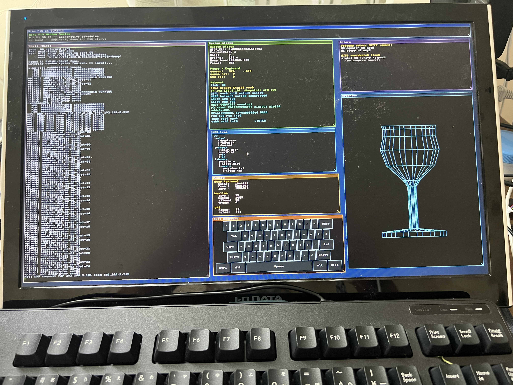
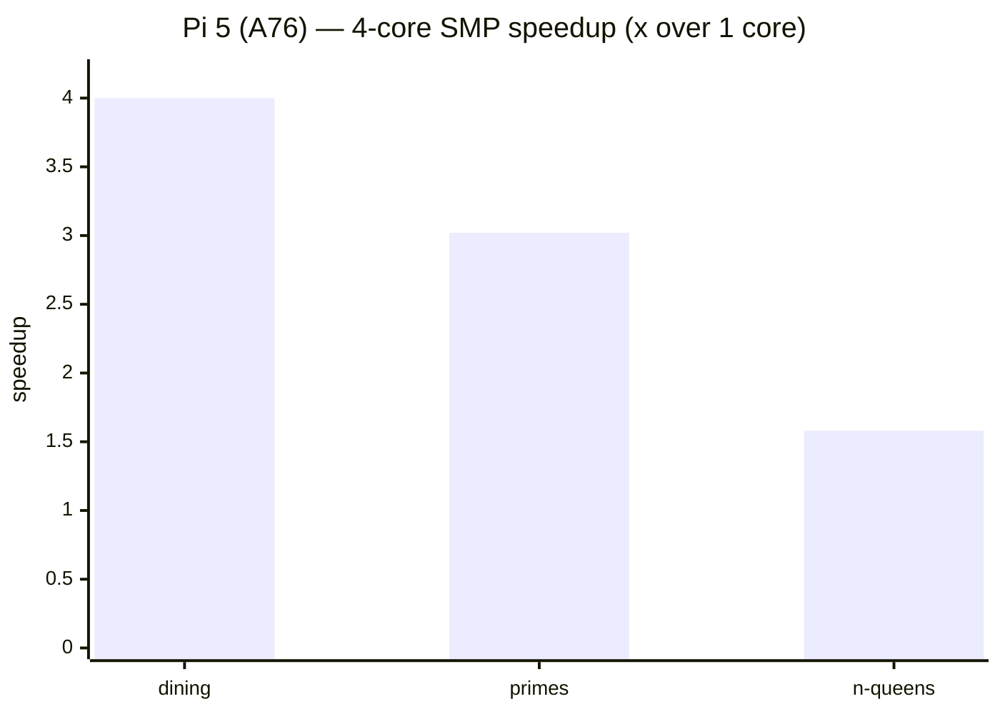
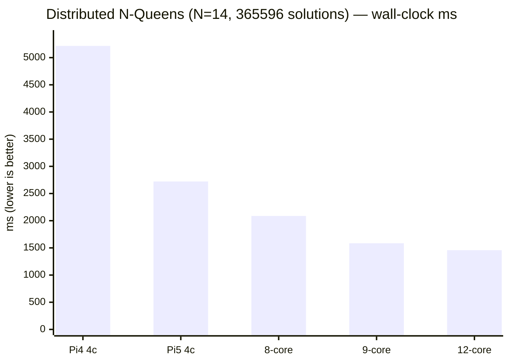
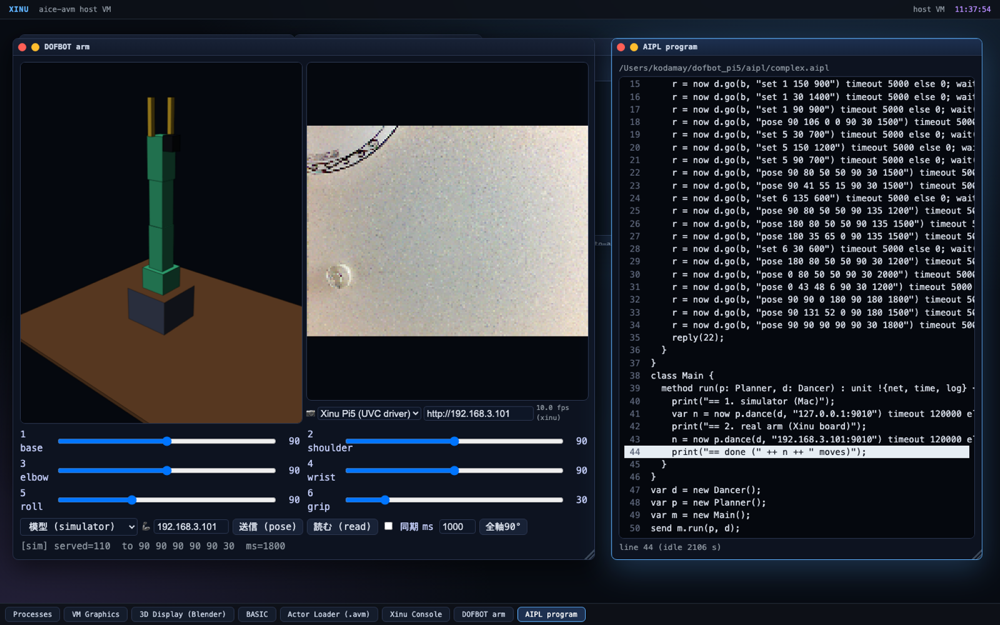
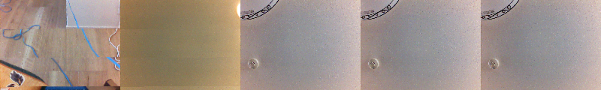

# xinu-rpi5

Embedded Xinu port for the **Raspberry Pi 5 (BCM2712, Cortex-A76, AArch64)**,
running bare-metal on real hardware.



*Xinu on real Pi 5 hardware: a window-managed HDMI desktop with a live shell,
system-status / actors / VFS-tree / memory panels, an on-screen keyboard, and a
spinning 3-D wireframe wine glass — driven by a USB mouse and keyboard over the
RP1 xHCI controllers.*

Bootstrapped from [`yaskodama/xinu-rpi`](https://github.com/yaskodama/xinu-rpi)
(32-bit arm-qemu / arm-rpi) and the AArch64 boot pattern from
[`radlyeel/leex`](https://github.com/radlyeel/leex). It has since grown from a
serial hello-world into a small interactive system: an HDMI window manager,
USB-A input, wired + WiFi networking with an HTTP gateway, microSD storage, an
on-device C/AIPL compiler, and a `kexec` selector across four OS variants.

## Multi-core SMP, D-cache & self-forming Wi-Fi mesh (2026 experiments)

This port is one of three siblings — **xinu-rpi3 (A53)**, **xinu-rpi4 (A72)**,
**xinu-rpi5 (A76, this one)** — joined into a single self-forming cluster and
benchmarked together. Full write-ups are in the companion `smp_report`
(per-board SMP + D-cache) and `mesh_report` (mesh + distributed) PDFs.

**4-core worker-pool SMP.** Core 0 runs the OS; cores 1–3 are compute workers
(`system/smp.c`) that wait in `wfe` for a job posted to a lock-free mailbox, run
a `[lo,hi)` range function, and signal done. `boot.S` releases the secondaries
into `_smp_start`, and `mmu_enable_secondary()` brings each worker up on core 0's
page tables with **MMU + I-cache on, D-cache off**. Measured (`agree=yes`):

| Benchmark            | 1-core | 4-core | Speedup |
|----------------------|-------:|-------:|:-------:|
| dining (philosophers)| 152800 µs | 38203 µs | **4.00×** |
| primes (count)       | 66819 µs | 22105 µs | **3.02×** |
| n-queens (n=12, block split) | 125753 µs | 79269 µs | 1.58× |


```mermaid
xychart-beta
    title "Pi 5 (A76) — 4-core SMP speedup (x over 1 core)"
    x-axis [dining, primes, "n-queens"]
    y-axis "speedup" 0 --> 4.2
    bar [4.00, 3.02, 1.58]
```

The A76 is the fastest of the three boards (≈1.9× the A72 per core), which makes
it the node that takes the heaviest work in the distributed benchmark below.

**D-cache experiment.** The default build runs every core with the D-cache
**off** (free mailbox coherency). A `DCACHE_ON` build turns it on and keeps the
lock-free mailbox coherent with **explicit maintenance** (`dc cvac` / `dc ivac`).
On this A76 the cores share a **DSU** (DynamIQ Shared Unit); the experiment
confirmed multi-core D-cache is workable here — as on the A72 and A53 — provided
the mailbox is explicitly cleaned/invalidated (verified by the benchmark's
`agree=` column). Clean serial capture required masking IRQs and spinning on the
UART TXFF during the timed run (the 32-byte FIFO otherwise overflows).

**Self-forming Wi-Fi ad-hoc mesh.** All three boards join one IBSS cell with no
access point: SSID `MANET`, channel 6, fixed BSSID `02:4d:41:4e:45:54`, static
`10.0.0.n/24` (this board is **node 3 = 10.0.0.3**). A periodic **HELLO beacon**
(UDP/5000, every 2 s, `device/wifi/wifi.c`) announces the node id; each board
records the senders it hears, so neighbour tables fill automatically — power-on
and join is all it takes. This board reports convergence in its MANET status as
`@B peers n=… hello_tx=… ids=…` (the Pi 3/Pi 4 expose the same via `GET /manet`).

**Distributed benchmark routes.**
- `GET /bench?kind=nqueens|dining|primes[&n=N][&cores=K]` — the SMP benchmark
  above (1-core vs 4-core, µs, speedup, `agree=`).
- `GET /nqpart?n=N&c0=A&c1=B` — count N-Queens solutions for first-queen columns
  `[c0,c1)`, split across this board's 4 cores. A Mac orchestrator hands each
  board a disjoint range and sums the partials, so the mesh solves one problem as
  a **12-core (3×4) distributed computer**. This A76 node takes the heavy centre
  columns; best 3-board result: N=14 (365 596 solutions) in **1 458 ms — 1.87×
  this board alone** (2 722 ms), sum verified. See `mesh_report` for the
  capacity/granularity efficiency analysis (2.32× heterogeneous ceiling, ~80%).


```mermaid
xychart-beta
    title "Distributed N-Queens (N=14, 365596 solutions) — wall-clock ms"
    x-axis ["Pi4 4c", "Pi5 4c", "8-core", "9-core", "12-core"]
    y-axis "ms (lower is better)" 0 --> 5400
    bar [5216, 2722, 2088, 1585, 1458]
```

## What works

A single-image AArch64 kernel with the MMU enabled (BCM2712, Cortex-A76):

- **HDMI framebuffer + window system** — a desktop with a live shell window,
  system-status / actors / VFS-tree / memory panels, an on-screen keyboard, and
  a spinning 3-D wireframe.
- **USB mouse + keyboard** — via the two RP1 DWC3/xHCI controllers (over PCIe);
  the cursor and shell input are USB-driven.
- **Wired Ethernet over RP1** — TCP/IP + an HTTP gateway on static
  `192.168.3.101` (`/run?cmd=…`, `/fs`, `/microsd/write`, `/api/actors`, …).
- **WiFi (CYW43455)** — scan / WPA2 / DHCP / ping; connects on `wifi on` (no
  auto-connect at boot).
- **microSD (FAT32)** — read + persistent small-file write, mounted at
  `/microsd`.
- **`kexec` selector** — swap to another kernel in RAM with no re-flash and no
  brick risk; **four OS variants** (Full / OS1-minimal / OS2-no-WM /
  OS3-lower-res) from one source tree.
- **On-device tooling** — `cc` / `make` compile and run a C/AIPL program in
  place; an AIPL actor gateway.
- **Robot arm (Yahboom DOFBOT) + USB camera + fan** — an RP1 I²C driver talks
  to the arm's servo board, a UVC driver receives isochronous video from the
  wrist camera, and the Pi 5 fan is driven by RP1 PWM with a thermal curve; an
  AIPL actor on the board exposes the arm to the network. See
  [Robot arm](#robot-arm-yahboom-dofbot--i²c-uvc-camera-fan-aipl) below.

**Boot media.** The board **boots from a USB stick**: the firmware loads
`kernel_2712.img` from the stick's FAT partition (`bootfs`). The on-board
microSD slot is normally empty and is used as a **data** area (mounted at
`/microsd`).

## Key specifications

| Item | Value |
|------|-------|
| SoC | BCM2712 (Cortex-A76, AArch64) |
| Kernel image | `kernel_2712.img` (entry `0x80000`) |
| MMU | enabled (identity map, caches off) |
| Debug UART | `0x107D001000` (3-pin JST, 115200 8N1) |
| HDMI | 1920×1080×32 default (OS3 = 1280×720) |
| Wired IP (static) | `192.168.3.101` |
| USB host | RP1 DWC3/xHCI (over PCIe) |

## Build

```sh
# Mac (Homebrew AArch64 cross toolchain — pick either):
brew install aarch64-elf-gcc           # GNU
brew install --cask gcc-arm-embedded   # ARM-supplied

cd compile
make pi5        # Full OS         -> kernel_2712.img
make pi5-osmin  # OS1 (minimal)   -> kernel_min.img
make pi5-os2    # OS2 (no WM)      -> kernel_os2.img
make pi5-os3    # OS3 (lower res)  -> kernel_os3.img
```

## Deploy

Write the image to the **USB stick** (FAT partition `bootfs`), then boot the Pi:

```sh
diskutil mount /dev/disk4s1
cp compile/kernel_2712.img /Volumes/bootfs/kernel_2712.img
sync && diskutil unmount /dev/disk4s1
# put the stick back in the Pi 5 and power on (boot log appears after ~10 s)
```

The microSD card may hold the alternate OS images (`OS1.IMG`, `OS2.IMG`,
`OS3.IMG`) for `kexec`.

## The four OS variants + kexec

| Name | Image | Characteristics |
|------|-------|-----------------|
| Full OS | `kernel_2712.img` | window system + networking (all features) |
| OS1 | `OS1.IMG` | shell only — no networking, no windows |
| OS2 | `OS2.IMG` | all features, text console instead of the WM |
| OS3 | `OS3.IMG` | all features, HDMI lowered to 1280×720 |

`kexec` loads a kernel from the microSD into RAM and jumps to it without a power
cycle — RAM-only, so a bad image is recovered by power-cycling back into the USB
full OS (no brick risk). Only bare-metal Xinu images (< 4 MB) can be chainloaded.

```sh
kexec /microsd/OS1.IMG       # boot OS1 (minimal)
kexec /microsd/OS2.IMG       # boot OS2 (no WM)
```

## Remote operation (HTTP)

The Full OS / OS2 / OS3 serve HTTP on `192.168.3.101`:

```sh
curl 'http://192.168.3.101/run?cmd=ls%20/microsd'
curl 'http://192.168.3.101/run?cmd=wifi%20status'
curl -X POST --data-binary "hello" http://192.168.3.101/microsd/write/TEST.TXT
```

Endpoints: `/run?cmd=`, `/fs` (+ `/fs/ls`, `/fs/cat`, `/fs/write`),
`/microsd/write/<NAME>`, `/usb/...`, `/api/actors`, `/send?to=&m=`,
`/arm/...`, `/cam...`, `/fan` (robot arm, camera, fan — see below).

## WiFi

The on-board CYW43455 does infrastructure WiFi (scan / WPA2 / DHCP / ping). It
**does not auto-connect at boot** — run `wifi on`. From the shell (`xinu-pi5$`,
USB keyboard) or over HTTP (`/run?cmd=wifi%20...`):

```sh
wifi on <ssid> <pass>   # bring up firmware (~10 s), join WPA2, DHCP
wifi on                 # reuse the last creds, or the build-time wifi.conf
wifi scan               # bring up the radio and list nearby APs
wifi status             # connection state, SSID, IP
wifi off                # radio down
wifi-invest             # diagnostics when it won't come up
```

A successful `wifi on` ends with `wifi: CONNECTED IP=…`; a WiFi icon plus the
SSID/IP is drawn bottom-right on the desktop. Credentials are embedded at build
time from a `.gitignore`d `wifi.conf` — never commit the password.

## Mesh networking (MANET ad-hoc)

Several Pi 5 (and Pi 4 / Pi 3) Xinu nodes can form a peer-to-peer mesh with **no
access point**, using 802.11 IBSS (ad-hoc) mode plus on-demand AODV multi-hop
routing — the same MANET stack the boards use in the drone-HIL demo.

```sh
wifi adhoc <cell-ssid> [ch] [node]   # join an ad-hoc cell as 10.0.0.<node>
wifi aodv  <a.b.c.d>                 # discover a multi-hop route on demand
```

- `wifi adhoc mesh1 6 1` brings the radio up in IBSS mode on the named cell
  (BSSID `02:4d:41:4e:45:54` = "MANET"), channel `6` (default), and takes the
  static IP `10.0.0.1` (the `[node]` number, default `1`). The AODV relay then
  runs automatically.
- **All nodes use the same cell SSID and channel, with a distinct `[node]`
  number** (`10.0.0.<node>/24`). Nodes in radio range reach each other directly
  at `10.0.0.x`.
- For a destination beyond direct range, `wifi aodv 10.0.0.3` broadcasts an RREQ
  (UDP 654); intermediate nodes relay it and the destination replies with an
  RREP, installing a multi-hop route (`AODV route: 10.0.0.3 via 10.0.0.2, 2
  hop`). Run `wifi adhoc` first so the node has an IP.

Ad-hoc/AODV is independent of the infrastructure `wifi on` mode and is not
restored after reboot — re-run `wifi adhoc` on each node.

## Robot arm (Yahboom DOFBOT) — I²C, UVC camera, fan, AIPL

*2026-09-14.* The Pi 5 that ships with the **Yahboom DOFBOT** (6-axis arm,
Raspberry Pi 5 edition) runs this kernel instead of Linux, and drives the arm,
its wrist camera and the cooling fan directly. Nothing else runs on the board.



*The Mac-side Xinu desktop simulator (aice-avm): a 3-D model of the arm drawn
from the six servo angles, the **live video received by Xinu's own UVC driver**
on the right, and an "AIPL program" window that inverts the statement being
executed. The same AIPL program drives the model and the real arm.*



*Five frames taken from the board (`/cam`) during a 22-move choreography:
floor and cables when the arm looks down, a wall close-up, then the ceiling
once it stands upright.*

### What the board can do

| Piece | Where | What it is |
|---|---|---|
| RP1 I²C1 master | `device/i2c/rp1i2c.c` | DesignWare I²C at `0x1F00074000`, GPIO2/3 (FUNCSEL 3), 100 kHz, fully polled with `cntpct` deadlines. Refuses itself if `IC_COMP_TYPE` is not the DesignWare id (RP1 returns `0xDEADDEAD` for an unclocked block). |
| Arm layer | `system/arm.c` | The DOFBOT servo board is I²C slave `0x15` (an STM8 that drives six bus servos). The wire format is exactly Yahboom's `Arm_Lib.py`: `0x10+id` one servo, `0x1E`→`0x1D` six servos at once, `0x30+id` read-back, `0x02` RGB, `0x06` buzzer, `0x1A` torque, `0x38` ping, `0x05` reset. Angle→position is `900+2200·θ/180` (servo 5: `380+3320·θ/270`; servos 2–4 are mirrored as `180−θ`). Retries an I²C timeout up to three times and resets the board after three all-failed reads (it stalls while it is talking to the servos). |
| Text command | shell `arm …`, HTTP `/arm/...` | `pose a1 a2 a3 a4 a5 a6 [ms]`, `set id ang [ms]`, `read`, `rgb r g b`, `buzz n`, `torque 0/1`, `ping id`, `ver`, `scan`, `stat`, `reset`. One function, `arm_command()`, serves both. |
| AIPL built-in | `cc/cc.c` `v_arm_cmd` | `arm_cmd(s: string): string` (effect `io`) in the on-board AIPL. The actor below is loaded automatically 50 s after boot, so `remote_call("192.168.3.101:9010","dofbot","cmd","pose 90 90 90 90 90 30 1500")` works from any AIPL implementation right after a power cycle. |
| UVC camera | `device/usb/rp1usb.c` (end of file) | USB Video Class over **isochronous** transfers on the RP1 xHCI: descriptor probe (`/usb/cam-probe`), `SET_CONFIGURATION` → VS Probe/Commit → `SET_INTERFACE`, an Isoch-IN endpoint context, a 512-entry TRB ring re-armed as each TRB completes, and frame assembly from the UVC payload header (FID/EOF). 320×240 YUY2 at 10 fps from a Microdia `0c45:6340`; event ring enlarged 64→1024. |
| Camera output | HTTP `/cam...` | `/cam/start?frame=3&fps=10`, `/cam/stat`, `/cam?w=160` (dimensions), `/cam?w=160&off=N` (RGB565 in 12 KB chunks, CORS, same shape as `/fb`), `/cam.yuv?off=N`. The frame is snapshotted on `off=0` so a multi-chunk fetch never straddles two frames. |
| Fan | `device/genet/rp1fan.c` | RP1 PWM1 channel 3 on GPIO45, `clk_pwm1` from the 50 MHz xosc, the same 41566 ns period and inverted polarity as Linux's `cooling_fan`. Every 10 s the SoC temperature is read over the mailbox (`GET_TEMPERATURE`) and the fan follows Linux's steps (50/60/67.5/75 °C → 75/125/175/250). `/fan`, `/fan?level=`, `/fan?auto=1`. |

```aipl
// The actor that lives on the board (loaded at boot; also ~/dofbot_pi5/aipl/dofbot_arm.aipl)
class Arm {
  var count = 0;
  method cmd(s: string) : string !{io, mut} { count = count + 1; reply(arm_cmd(s)); }
  method served() : int !{} { reply(count); }
}
var arm = new Arm();
web_expose("/dofbot", "arm");
```

```sh
curl http://192.168.3.101/arm/read                      # angles 90 90 90 90 90 30
curl http://192.168.3.101/arm/pose/90/90/90/90/90/30/2000
curl http://192.168.3.101/cam/stat                      # frames=… pkts=… errs=0
curl "http://192.168.3.101/fan"                         # fan level=75 auto=1 soc_temp_mC=40577 …
```

### Applications

- **Plan on the Mac, act on the board.** The canonical AIPL (OCaml) gained
  `remote_call(host:port, actor, method, arg, ms)` (effect `net`) — the same
  one-line ASCII `Q`/`R` datagrams on UDP/9010 that the boards already speak —
  and `arm_cmd` (effect `io`). A planner actor never touches the arm; the `Arm`
  actor on the board is the only thing with `io`. A 22-move choreography
  (Yahboom's look/grab/stack poses) runs first against a **software model of
  the arm inside the desktop simulator** (`127.0.0.1:9010`, actor `dofbot`,
  identical interface) and then against the real board, by changing only the
  address. Measured: 44/44 replies `ok`.
- **Watching the program run.** The OCaml evaluator sends `PC line col actor
  file` over UDP/9011 for every statement; the simulator's *AIPL program*
  window inverts that line. Writing each move as one line (`r = now d.go(b,
  "pose …") …; wait(1750);`) keeps the executing move highlighted for as long
  as the arm is moving.
- **Camera in the loop.** The wrist camera is received by Xinu itself and
  shown in the simulator window; it can be fetched by any client (CORS) at a
  few frames per second. The next step is an AIPL built-in (`cam_frame()` /
  tag detection) so the planner can see.
- **Known limits.** The camera exposes YUY2 only (no MJPEG), so 640×480 would
  need 18 MB/s — use 320×240 or smaller. The EP0 transfer ring is shared by all
  USB devices, so the camera is re-addressed each time streaming starts.
  Grasping the cube is still unsolved: the wrist camera cannot see the fingers.

The full write-up (three-layer control path under Linux, the Xinu port, the
AIPL actors, the simulator windows, the UVC driver and its first failure, fan)
is the 8-page report *Mac から DOFBOT（Raspberry Pi 5）を動かす制御経路*
(`reports/2026-09-14_dofbot_xinu_aipl_uvc.pdf` on kodamay.org). Hand-off notes
for the next session: `NEXT_SESSION_DOFBOT.md`.

### 日本語：ロボットアーム（Yahboom DOFBOT）—— I²C・UVC カメラ・ファン・AIPL

*2026-09-14.* **Yahboom DOFBOT（6 軸アーム、Raspberry Pi 5 版）**に付属する Pi 5 で、
Linux の代わりにこのカーネルを起動し、アーム・手首カメラ・冷却ファンを Xinu 自身が直接動かしています。
板の上には他に何も走っていません。

上の 1 枚目の図は Mac 側の Xinu デスクトップシミュレータ（aice-avm）で、6 軸のサーボ角から描いた
アームの 3D 模型、**Xinu 自身の UVC ドライバが受けた生映像**、実行中の文の行を反転する「AIPL program」窓です。
2 枚目は 22 手の振り付け中に板の `/cam` から採った 5 コマ（腕が下を向いたときの床とケーブル、壁の接写、直立に戻ったときの天井）。

**板ができること**

| 部品 | 場所 | 内容 |
|---|---|---|
| RP1 I²C1 マスタ | `device/i2c/rp1i2c.c` | `0x1F00074000` の DesignWare I²C、GPIO2/3（FUNCSEL 3）、100 kHz、全部ポーリング＋`cntpct` の期限。`IC_COMP_TYPE` が DesignWare の値でなければ自分を無効化（RP1 は無クロックの周辺に `0xDEADDEAD` を返す）。 |
| アーム層 | `system/arm.c` | DOFBOT の基板は I²C スレーブ `0x15`（STM8 が 6 個のバスサーボを駆動）。電文は Yahboom の `Arm_Lib.py` と同じ：`0x10+id` 1 軸、`0x1E`→`0x1D` 6 軸一括、`0x30+id` 読み戻し、`0x02` RGB、`0x06` ブザー、`0x1A` トルク、`0x38` ping、`0x05` リセット。角度→位置は `900+2200·θ/180`（サーボ 5 は `380+3320·θ/270`、2〜4 は `180−θ` に反転）。I²C 時間切れは 3 回まで再試行、読みが 3 回全滅なら基板をリセット（サーボと通信中は止まる）。 |
| 文字列命令 | シェル `arm …`、HTTP `/arm/...` | `pose a1 a2 a3 a4 a5 a6 [ms]`、`set id ang [ms]`、`read`、`rgb r g b`、`buzz n`、`torque 0/1`、`ping id`、`ver`、`scan`、`stat`、`reset`。どちらも同じ `arm_command()`。 |
| AIPL 組込み | `cc/cc.c` `v_arm_cmd` | 機内 AIPL の `arm_cmd(s: string): string`（効果 `io`）。下のアクターは起動 50 秒後に自動で載るので、電源を入れ直した直後から `remote_call("192.168.3.101:9010","dofbot","cmd","pose 90 90 90 90 90 30 1500")` が通る。 |
| UVC カメラ | `device/usb/rp1usb.c`（末尾） | RP1 xHCI 上の **等時転送**による USB Video Class：記述子の下見（`/usb/cam-probe`）、`SET_CONFIGURATION` → VS Probe/Commit → `SET_INTERFACE`、等時 IN のエンドポイント文脈、512 個の TRB 環（消費のたび積み直し）、UVC ペイロードヘッダ（FID/EOF）でフレーム組み立て。Microdia `0c45:6340` から 320×240 YUY2 @10 fps。イベント環は 64→1024。 |
| カメラ出力 | HTTP `/cam...` | `/cam/start?frame=3&fps=10`、`/cam/stat`、`/cam?w=160`（寸法）、`/cam?w=160&off=N`（RGB565 を 12 KB ずつ、CORS、`/fb` と同じ形）、`/cam.yuv?off=N`。`off=0` でフレームを写し取るので、分割取得が 2 枚にまたがらない。 |
| ファン | `device/genet/rp1fan.c` | GPIO45 の RP1 PWM1 チャネル 3、`clk_pwm1` は xosc 50 MHz、周期 41566 ns・反転極性は Linux の `cooling_fan` と同じ。10 秒ごとにメールボックス（`GET_TEMPERATURE`）で SoC 温度を読み、Linux と同じ段（50/60/67.5/75 ℃ → 75/125/175/250）で追従。`/fan`、`/fan?level=`、`/fan?auto=1`。 |

**応用例**

- **計画は Mac、動作は板。** 正典 AIPL（OCaml）に `remote_call(host:port, actor, method, arg, ms)`（効果 `net`。板がすでに話している
  UDP/9010 の一行 ASCII `Q`/`R` 電文をそのまま使う）と `arm_cmd`（効果 `io`）を足しました。計画側のアクターは腕に触らず、
  板の `Arm` アクターだけが `io` を持ちます。22 手の振り付け（Yahboom の見る／掴む／積む姿勢）を、まず**デスクトップシミュレータの中の
  アームの模型**（`127.0.0.1:9010`、同じ `dofbot` アクター）で、次に住所だけ変えて実機で走らせます。実測 44/44 応答 `ok`。
- **プログラムの実行を見る。** OCaml の評価器が文ごとに `PC 行 列 アクター ファイル` を UDP/9011 へ撒き、シミュレータの
  「AIPL program」窓がその行を反転します。一手を一行（`r = now d.go(b, "pose …") …; wait(1750);`）に書くと、
  腕が動いているあいだその手の行が反転し続けます。
- **カメラを輪の中へ。** 手首カメラは Xinu 自身が受け、シミュレータの窓に出ます。どのクライアントからも（CORS）毎秒数コマで取れます。
  次は AIPL の組込み（`cam_frame()`／タグ検出）にして、計画側が見えるようにします。
- **既知の制約。** カメラは YUY2 のみ（MJPEG なし）なので 640×480 だと 18 MB/s になります —— 320×240 以下で使います。
  EP0 の転送環は全 USB 装置で共有なので、配信開始のたびにカメラをアドレスし直します。立方体の把持は未解決（手首カメラに指が映りません）。

全体の記録（Linux 上の三層の制御経路、Xinu 移植、AIPL アクター、シミュレータの窓、UVC ドライバとその最初の失敗、ファン）は
8 頁のレポート *Mac から DOFBOT（Raspberry Pi 5）を動かす制御経路*（kodamay.org の `reports/2026-09-14_dofbot_xinu_aipl_uvc.pdf`）。
次回への引き継ぎは `NEXT_SESSION_DOFBOT.md`。

## Documentation

- **User's manual** (operator-facing, EN + JA): typeset PDFs under `docs/`
  (`docs/xinu-pi5-manual-en.pdf` / `docs/xinu-pi5-manual.pdf`; sources
  `docs/xinu-pi5-manual-en.tex` / `docs/xinu-pi5-manual.tex`). Markdown mirrors:
  `USERS_MANUAL_EN.md` / `USERS_MANUAL_JA.md`. They cover flashing, the OS
  variants, `kexec`, microSD, the shell, remote HTTP operation, WiFi, and USB.
- Session handoff notes: `NEXT_SESSION.md`; robot arm / camera / fan: `NEXT_SESSION_DOFBOT.md`.

## License

Inherits from upstream Xinu / leex (BSD-style). See `LICENSE` once the
source-of-truth license file is added.
